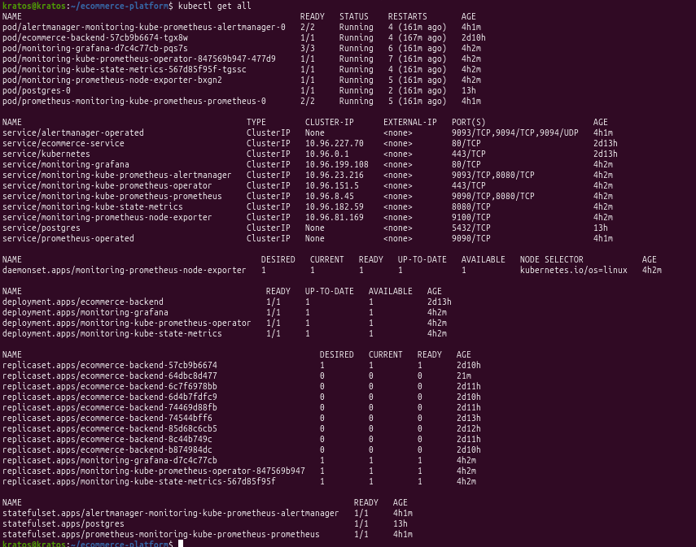
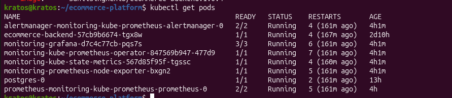

# 🚀 Kubernetes Platform Engineering Project


---

# Kubernetes Platform Engineering

A production-ready Platform Engineering project demonstrating modern cloud-native deployment practices using **Docker, Kubernetes, Helm, GitHub Actions, Argo CD (GitOps), Prometheus, and Grafana**.

This project showcases how an application progresses from development to a fully automated Kubernetes deployment with continuous delivery, observability, monitoring, and rollback capabilities.

The primary objective was not just to deploy an application, but to build a production-style platform that reflects real-world DevOps and Platform Engineering practices.

---

# Project Objectives

✔ Containerize a Python Flask application

✔ Deploy applications using Kubernetes

✔ Manage application configuration using ConfigMaps and Secrets

✔ Deploy applications using Helm Charts

✔ Automate builds with GitHub Actions

✔ Implement GitOps using Argo CD

✔ Monitor workloads using Prometheus

✔ Visualize metrics using Grafana

✔ Demonstrate Rolling Updates

✔ Demonstrate Rollbacks

✔ Learn production deployment workflow

---

# Project Architecture

The following diagram represents the complete deployment workflow.


---

# Platform Workflow

```text
                    Developer

                         │
                         │ Git Push
                         ▼

                  GitHub Repository

                         │
                         │ GitHub Actions
                         ▼

                 Build Docker Image

                         │
                         ▼

                    Docker Hub

                         │
                         ▼

                     Argo CD

                         │
                  GitOps Synchronization
                         │
                         ▼

               Kubernetes Cluster

        ┌──────────────────────────────────────┐
        │                                      │
        │ Deployment                           │
        │ ReplicaSets                          │
        │ Pods                                 │
        │ Services                             │
        │ ConfigMaps                           │
        │ Secrets                              │
        │ Persistent Volumes                   │
        │ Helm Releases                        │
        │                                      │
        └──────────────────────────────────────┘

                         │
             ┌───────────┴────────────┐
             ▼                        ▼

       Prometheus                Grafana

      Metrics Collection      Visualization
```

---

# Key Features

| Feature | Status |
|----------|--------|
| Docker Containerization | ✅ |
| Docker Hub Integration | ✅ |
| Kubernetes Pods | ✅ |
| Deployments | ✅ |
| ReplicaSets | ✅ |
| Services | ✅ |
| ConfigMaps | ✅ |
| Secrets | ✅ |
| Persistent Volumes | ✅ |
| Health Checks | ✅ |
| Liveness Probe | ✅ |
| Readiness Probe | ✅ |
| Rolling Updates | ✅ |
| Rollback | ✅ |
| Helm Charts | ✅ |
| GitHub Actions | ✅ |
| Argo CD | ✅ |
| GitOps | ✅ |
| Prometheus | ✅ |
| Grafana | ✅ |

---

# Technology Stack

| Category | Technologies |
|------------|----------------|
| Programming Language | Python |
| Framework | Flask |
| Database | PostgreSQL |
| Containerization | Docker |
| Container Registry | Docker Hub |
| Orchestration | Kubernetes |
| Package Manager | Helm |
| GitOps | Argo CD |
| CI/CD | GitHub Actions |
| Monitoring | Prometheus |
| Visualization | Grafana |
| Version Control | Git & GitHub |

---

# Repository Structure

```text
kubernetes-platform-engineering
│
├── .github
│   └── workflows
│       └── github-actions.yml
│
├── backend
│   ├── app.py
│   ├── Dockerfile
│   ├── requirements.txt
│   └── ...
│
├── compose
│   └── docker-compose.yml
│
├── kubernetes
│   ├── deployment.yaml
│   ├── service.yaml
│   ├── ingress.yaml
│   ├── configmap.yaml
│   ├── secret.yaml
│   ├── pvc.yaml
│   ├── pv.yaml
│   ├── namespace.yaml
│   ├── helm
│   │
│   └── screenshots
│       ├── architecture-diagram.png
│       ├── application-running.png
│       ├── dockerhub-image.png
│       ├── Github-actions-success.png
│       ├── Argocd-dashboard.png
│       ├── prometheus-targets.png
│       ├── grafana-dashboard.png
│       ├── Helm-releases.png
│       └── kubectl-get-all.png
│
├── monitoring
│   └── prometheus
│
├── README.md
│
└── kind-config.yaml
```

---

# Application Components

## Backend

A Python Flask REST application serving as the backend service.

Responsibilities:

- REST APIs
- Database connectivity
- Health endpoints
- Metrics exposure
- Containerized execution

---

## Database

PostgreSQL stores persistent application data.

Kubernetes Persistent Volumes ensure that data survives Pod restarts.

---

## Kubernetes

The application is deployed using Kubernetes resources including:

- Deployment
- Service
- ConfigMap
- Secret
- Persistent Volume
- Persistent Volume Claim
- Namespace

Helm manages these resources through reusable templates.

---
# Deployment Guide

## Prerequisites

Ensure the following tools are installed before deploying the application.

| Tool | Purpose |
|------|---------|
| Docker | Containerization |
| Kubernetes (Kind/Minikube) | Local Kubernetes Cluster |
| kubectl | Kubernetes CLI |
| Helm | Kubernetes Package Manager |
| Git | Version Control |
| GitHub | Source Code Repository |
| Docker Hub | Container Registry |
| Argo CD | GitOps Continuous Delivery |
| Prometheus | Monitoring |
| Grafana | Dashboard Visualization |

---

# Clone Repository

```bash
git clone https://github.com/<your-github-username>/kubernetes-platform-engineering.git

cd kubernetes-platform-engineering
```

---

# Build Docker Image

Navigate to the backend directory.

```bash
cd backend
```

Build the application image.

```bash
docker build -t sahilsinghchib/ecommerce-backend:1.0.0 .
```

Verify the image.

```bash
docker images
```

---

# Push Image to Docker Hub

Login

```bash
docker login
```

Push

```bash
docker push sahilsinghchib/ecommerce-backend:1.0.0
```

Verify the uploaded image.


---

# Kubernetes Deployment

Deploy the namespace.

```bash
kubectl apply -f kubernetes/namespace.yaml
```

Deploy ConfigMap.

```bash
kubectl apply -f kubernetes/configmap.yaml
```

Deploy Secret.

```bash
kubectl apply -f kubernetes/secret.yaml
```

Deploy Persistent Volume.

```bash
kubectl apply -f kubernetes/pv.yaml
```

Deploy Persistent Volume Claim.

```bash
kubectl apply -f kubernetes/pvc.yaml
```

Deploy PostgreSQL.

```bash
kubectl apply -f kubernetes/postgres.yaml
```

Deploy Backend.

```bash
kubectl apply -f kubernetes/deployment.yaml
```

Deploy Service.

```bash
kubectl apply -f kubernetes/service.yaml
```

Deploy Ingress.

```bash
kubectl apply -f kubernetes/ingress.yaml
```

---

# Verify Kubernetes Resources

Check all resources.

```bash
kubectl get all
```

Expected output should display:

- Namespace
- Pods
- ReplicaSets
- Deployments
- Services
- Persistent Volumes
- Persistent Volume Claims

Example:



---

# Health Checks

The application implements Kubernetes Health Probes.

## Liveness Probe

Used to determine whether the application should be restarted.

```yaml
livenessProbe:
  httpGet:
    path: /
    port: 5000
```

---

## Readiness Probe

Determines whether the Pod is ready to receive traffic.

```yaml
readinessProbe:
  httpGet:
    path: /
    port: 5000
```

These probes improve application availability during updates and failures.

---

# Helm Deployment

The project also supports deployment using Helm.

Install the chart.

```bash
helm install ecommerce ./kubernetes/helm
```

Verify installation.

```bash
helm list
```

Upgrade application.

```bash
helm upgrade ecommerce ./kubernetes/helm
```

Rollback release.

```bash
helm rollback ecommerce 1
```

Helm Releases


---

# Continuous Integration using GitHub Actions

This project implements an automated CI pipeline using GitHub Actions.

Pipeline stages:

✔ Checkout Repository

✔ Build Docker Image

✔ Login to Docker Hub

✔ Push Docker Image

✔ Validate Kubernetes Manifests

✔ Prepare Deployment

GitHub Actions Success


---

# GitOps using Argo CD

Argo CD continuously watches the GitHub repository for changes.

Whenever new manifests are pushed:

Developer

↓

Git Push

↓

GitHub Repository

↓

Argo CD Detects Change

↓

Automatic Synchronization

↓

Kubernetes Cluster Updated

This removes manual deployments and ensures the cluster always matches the Git repository.

Argo CD Dashboard


---

# Monitoring using Prometheus

Prometheus continuously scrapes metrics from Kubernetes workloads.

Metrics include:

- CPU Usage
- Memory Usage
- Pod Health
- Container Restarts
- Node Metrics
- Kubernetes Resource Usage

Prometheus Targets


---

# Visualization using Grafana

Grafana consumes Prometheus metrics and visualizes application health.

Implemented Dashboards

- CPU Usage
- Memory Usage
- Running Containers
- Node Metrics
- Resource Consumption
- Pod Status

Grafana Dashboard


---

# Application Running

The Flask application is successfully deployed and accessible through the Kubernetes Service.

Application Screenshot



---

# Rolling Updates

Kubernetes Deployments support zero-downtime rolling updates.

Update the application image.

```bash
kubectl set image deployment/ecommerce-backend backend=sahilsinghchib/ecommerce-backend:1.0.1
```

Monitor rollout.

```bash
kubectl rollout status deployment/ecommerce-backend
```

View rollout history.

```bash
kubectl rollout history deployment/ecommerce-backend
```

This ensures that application updates occur without downtime.

---

# Rollback Demonstration

If an updated version introduces an issue, Kubernetes allows rolling back instantly.

Rollback command.

```bash
kubectl rollout undo deployment/ecommerce-backend
```

Verify rollout.

```bash
kubectl rollout history deployment/ecommerce-backend
```

This restores the previous stable application version automatically with minimal downtime.

---
# Security Best Practices

Security was considered throughout the implementation to align with production-ready Kubernetes practices.

## Secrets Management

Sensitive data such as database credentials are stored using **Kubernetes Secrets** instead of hardcoding values inside application code.

Benefits:

- Prevents credential exposure
- Easy credential rotation
- Better separation between code and configuration

---

## ConfigMaps

Application configuration is managed using **ConfigMaps**.

Examples:

- Environment Variables
- Application Configuration
- Database Host
- Service Endpoints

This allows configuration changes without rebuilding Docker images.

---

## Persistent Storage

Persistent Volumes (PV) and Persistent Volume Claims (PVC) were implemented for PostgreSQL.

Advantages:

- Data survives Pod restarts
- Decouples storage from containers
- Enables stateful workloads

---

## Health Probes

Liveness and Readiness Probes improve application availability.

Benefits:

- Automatic recovery from failures
- Prevents traffic to unhealthy Pods
- Enables zero-downtime deployments

---

# Project Workflow Summary

This project follows a modern Platform Engineering workflow.

```text
Developer

        │
        ▼

GitHub Repository

        │
        ▼

GitHub Actions

        │
        ▼

Docker Build

        │
        ▼

Docker Hub

        │
        ▼

Argo CD

        │
        ▼

Kubernetes Cluster

        │
        ├──────────────┐
        ▼              ▼

Prometheus       Grafana

Monitoring     Visualization
```

---

# Skills Demonstrated

This project demonstrates hands-on experience with:

### Containerization

- Docker
- Docker Hub

### Kubernetes

- Pods
- Deployments
- ReplicaSets
- Services
- Namespaces
- ConfigMaps
- Secrets
- Persistent Volumes
- Persistent Volume Claims
- Ingress
- Health Checks

### DevOps

- Git
- GitHub
- GitHub Actions
- CI/CD Pipelines

### GitOps

- Argo CD
- Automated Synchronization
- Continuous Deployment

### Monitoring

- Prometheus
- Grafana

### Platform Engineering

- Infrastructure Automation
- Production Deployments
- Rolling Updates
- Rollbacks
- Observability
- High Availability Concepts

---

# Challenges Faced

Throughout the project several real-world issues were encountered and resolved.

## ImagePullBackOff

Issue:

Kubernetes could not pull the container image.

Resolution:

- Tagged the Docker image correctly
- Pushed the image to Docker Hub
- Updated Deployment manifest

---

## Port Forward Conflicts

Issue:

Port already in use.

Resolution:

- Identified conflicting process
- Released occupied port
- Restarted port-forward session

---

## Ingress Configuration

Issue:

Ingress resources were unavailable initially.

Resolution:

- Installed the Ingress Controller
- Applied Ingress resources
- Verified routing

---

## GitHub Authentication

Issue:

Authentication failures while pushing code.

Resolution:

- Generated a Personal Access Token (PAT)
- Updated Git credentials
- Successfully pushed repository

---

# Lessons Learned

This project provided practical experience in building and operating a production-style Kubernetes platform.

Key takeaways include:

- Kubernetes object lifecycle
- Production deployment strategies
- GitOps workflows
- Infrastructure as Code concepts
- Monitoring and observability
- CI/CD automation
- Troubleshooting Kubernetes workloads
- Zero-downtime deployments
- Helm package management
- Container lifecycle management

---

# Future Improvements

Possible enhancements include:

- Horizontal Pod Autoscaler (HPA)
- Vertical Pod Autoscaler (VPA)
- Cluster Autoscaler
- Service Mesh using Istio
- Terraform for Infrastructure Provisioning
- External Secrets Operator
- HashiCorp Vault Integration
- Loki for Centralized Logging
- Distributed Tracing using Jaeger
- Multi-Cluster Kubernetes Deployment
- Blue-Green Deployments
- Canary Deployments
- KEDA Event-Driven Scaling
- Policy Enforcement using Kyverno
- Kubernetes Network Policies

---

# Project Screenshots

## Overall Architecture


---

## Application Running


---

## Docker Hub Image


---

## GitHub Actions Pipeline


---

## Argo CD Dashboard


---

## Prometheus Targets


---

## Grafana Dashboard


---

## Helm Releases


---

## Kubernetes Resources


---

# Conclusion

This project demonstrates an end-to-end Platform Engineering workflow by combining containerization, Kubernetes orchestration, CI/CD automation, GitOps, monitoring, and deployment best practices.

It reflects a production-inspired approach to deploying and managing cloud-native applications while emphasizing automation, scalability, observability, and reliability.

---

# Author

## Sahil Singh Chib

**Platform Engineer**

Passionate about building reliable cloud-native platforms using Kubernetes, Docker, GitOps, Infrastructure Automation, and modern DevOps practices.

### Core Skills

- Kubernetes
- Docker
- Helm
- GitHub Actions
- Argo CD
- Prometheus
- Grafana
- Azure
- Linux
- Git
- Python
- PostgreSQL
- Platform Engineering
- DevOps
- Cloud Infrastructure

---

### If you found this project helpful, consider giving it a ⭐ on GitHub.

It helps others discover the project and supports my work.

---

**Thank you for visiting this repository.**
