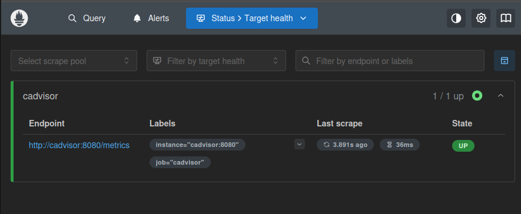
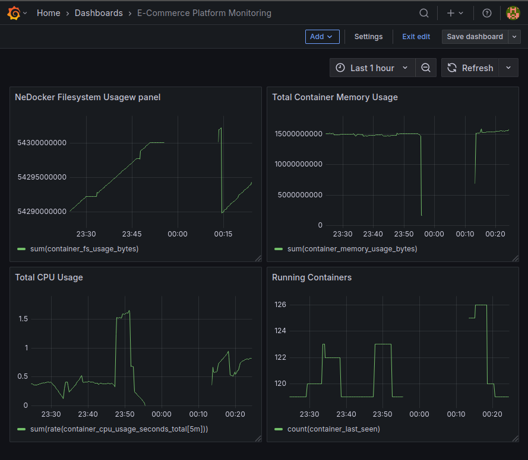
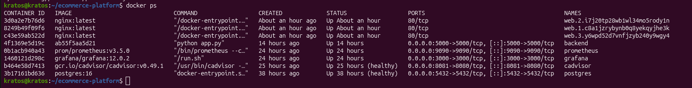
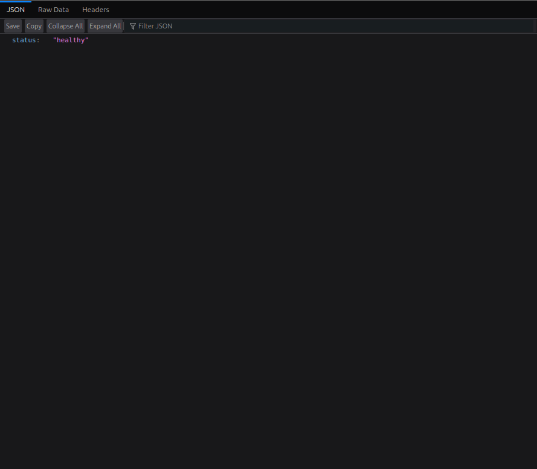

# 🚀 E-Commerce DevOps Engineering Project

## Overview

This project demonstrates the deployment, monitoring, troubleshooting, security scanning, alerting, and recovery of a containerized e-commerce platform using modern DevOps and Platform Engineering practices.

The objective was to simulate a production-style environment and gain hands-on experience with:

* Docker
* Docker Compose
* PostgreSQL
* Prometheus
* Grafana
* cAdvisor
* Trivy Security Scanning
* Health Checks
* Alerting
* Incident Response
* Deployment Rollback

The project follows workflows commonly used by DevOps Engineers, Platform Engineers, Site Reliability Engineers (SREs), and Cloud Engineers.

---

# 🏗 Architecture


## Application Flow

```text
User
 │
 ▼
Flask Application
 │
 ▼
PostgreSQL Database
```

## Monitoring Flow

```text
Application Containers
        │
        ▼
     cAdvisor
        │
        ▼
    Prometheus
        │
        ▼
      Grafana
```

---

# ⚙️ Technology Stack

| Category           | Technology     |
| ------------------ | -------------- |
| Application        | Python Flask   |
| Database           | PostgreSQL     |
| Containerization   | Docker         |
| Orchestration      | Docker Compose |
| Monitoring         | Prometheus     |
| Metrics Collection | cAdvisor       |
| Visualization      | Grafana        |
| Security Scanning  | Trivy          |
| Version Control    | Git            |
| Repository Hosting | GitHub         |

---

# 📁 Repository Structure

```text
ecommerce-platform/
│
├── backend/
│   ├── Dockerfile
│   ├── app.py
│   ├── requirements.txt
│   └── README.md
│
├── compose/
│   └── docker-compose.yml
│
├── monitoring/
│   └── prometheus/
│       └── prometheus.yml
│
├── screenshots/
│   ├── application-running.png
│   ├── architecture-diagram.png
│   ├── docker-containers.png
│   ├── grafana-dashboard.png
│   └── prometheus-targets.png
│
└── README.md
```

---

# ✨ Key Features

## Application Layer

* Flask-based REST API
* PostgreSQL Integration
* Health Check Endpoint
* Containerized Deployment

## Containerization

* Custom Docker Image
* Docker Compose Orchestration
* Internal Container Networking
* Persistent Database Storage

## Monitoring & Observability

* Real-Time Infrastructure Monitoring
* Resource Utilization Tracking
* Container-Level Metrics
* Dashboard Visualization
* Service Availability Monitoring

## Security

* Container Vulnerability Scanning
* Trivy Image Analysis
* Security Awareness Validation

---

# 🔄 Reliability Features

## Health Checks

PostgreSQL health checks were implemented to ensure dependent services start only after the database becomes available.

```yaml
healthcheck:
  test: ["CMD-SHELL", "pg_isready -U admin"]
  interval: 10s
  timeout: 5s
  retries: 5
```

### Why Health Checks Matter

Without health checks, the backend application may start before PostgreSQL is ready and fail during initialization.

Health checks help prevent startup race conditions and improve deployment reliability.

---

## Restart Policies

All containers use:

```yaml
restart: unless-stopped
```

Benefits:

* Automatic recovery after container crashes
* Recovery after host reboot
* Reduced manual intervention

---

## Dependency Management

Backend startup is controlled using:

```yaml
depends_on:
  postgres:
    condition: service_healthy
```

This ensures:

* PostgreSQL starts first
* Backend waits for database readiness
* Fewer deployment failures

---

# 📊 Monitoring Stack

## cAdvisor

cAdvisor collects container-level resource metrics including:

* CPU Usage
* Memory Usage
* Filesystem Usage
* Network Statistics

---

## Prometheus

Prometheus is responsible for:

* Metric Collection
* Time-Series Storage
* Service Monitoring
* Availability Tracking

Prometheus scrapes metrics from cAdvisor every 15 seconds.

### Prometheus Targets



---

## Grafana

Grafana provides dashboard visualization and monitoring capabilities.

### Grafana Dashboard



Monitored Metrics:

* Total Container Memory Usage
* Total CPU Usage
* Running Containers
* Filesystem Usage

---

# 🐳 Running Containers

The complete application stack is deployed using Docker Compose.

### Active Containers



Components:

* Flask Application
* PostgreSQL
* Prometheus
* Grafana
* cAdvisor

---

# 🚨 Alerting

Grafana alerting was configured to simulate production monitoring workflows.

### Backend Availability Alert

Condition:

```promql
up{job="cadvisor"} < 1
```

Evaluation Period:

```text
1 minute
```

Purpose:

* Detect service outages
* Simulate incident response workflows
* Validate monitoring effectiveness

---

# 🔍 Application Verification

### Application Running



Verify backend health:

```bash
curl http://localhost:5000/health
```

Expected Output:

```json
{
  "status": "healthy"
}
```

---

# 🔐 Security Scanning

Trivy was used to scan container images for vulnerabilities.

Example:

```bash
trivy image ecommerce-backend:1.0.0
```

Benefits:

* Detect vulnerable packages
* Detect outdated dependencies
* Improve container security posture
* Shift security validation earlier in the deployment lifecycle

---

# 🔄 Incident Simulation & Rollback

A deployment failure was intentionally simulated to demonstrate rollback procedures.

## Faulty Release

A broken image version was created:

```text
ecommerce-backend:1.1.0
```

Behavior:

* Application startup failure
* Container restart loop
* Service unavailable
* Failed health checks

---

## Rollback Procedure

The deployment was recovered by rolling back to the previously stable version:

```text
ecommerce-backend:1.0.0
```

Actions Performed:

1. Reverted image version
2. Rebuilt application image
3. Redeployed containers
4. Verified container health
5. Confirmed application availability
6. Validated monitoring recovery

Verification:

```bash
curl http://localhost:5000/health
```

Response:

```json
{
  "status": "healthy"
}
```

This demonstrates a real-world deployment recovery workflow commonly used in production environments.

---

# 🎯 Skills Demonstrated

* Docker
* Docker Compose
* Python Flask
* PostgreSQL
* Prometheus
* Grafana
* cAdvisor
* Trivy
* Infrastructure Monitoring
* Container Observability
* Incident Troubleshooting
* Alerting
* Deployment Rollback
* Git
* GitHub

---

# 📚 Learning Outcomes

Through this project I gained practical experience in:

* Building containerized applications
* Managing multi-container deployments
* Implementing health checks
* Designing monitoring dashboards
* Creating alerting rules
* Performing vulnerability scans
* Troubleshooting deployment failures
* Recovering from faulty deployments
* Implementing rollback strategies
* Maintaining infrastructure through version control

---

# 🔮 Future Enhancements

* Kubernetes Deployment
* GitHub Actions CI/CD Pipeline
* Terraform Infrastructure Provisioning
* Prometheus Alertmanager
* Centralized Logging
* Blue-Green Deployments
* Horizontal Scaling
* Automated Rollback Workflows

---

# 👨‍💻 Author

**Sahil**

Senior IT Support Engineer
Aspiring Devops Engineer

This project was created as part of my hands-on Platform Engineering and DevOps learning journey, focusing on real-world operational practices used in modern cloud-native environments.
