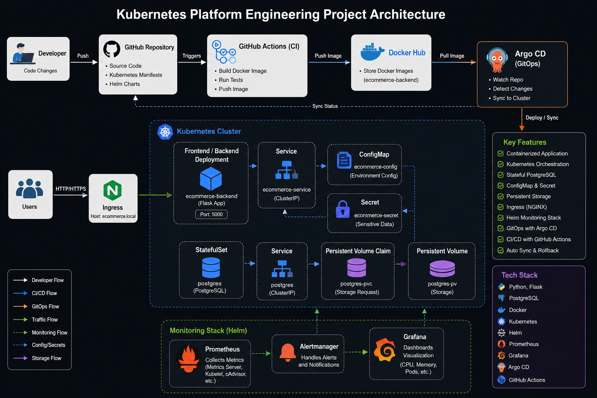
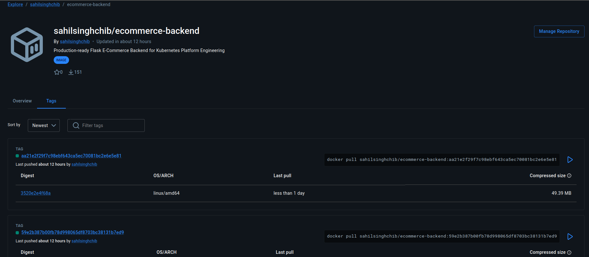
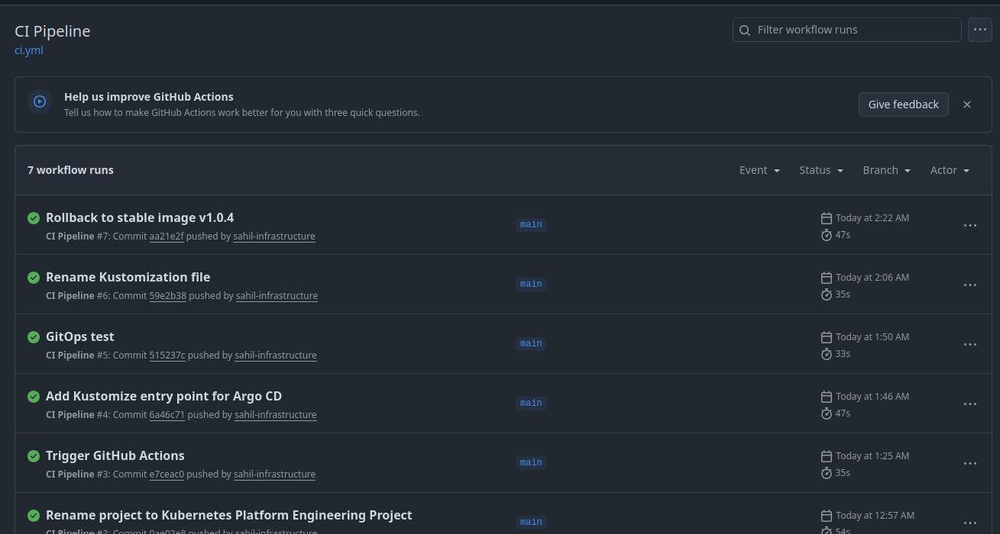
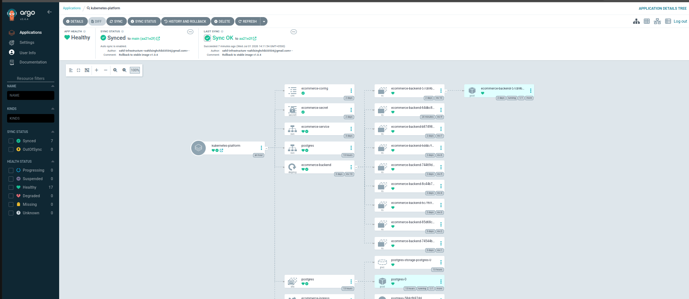
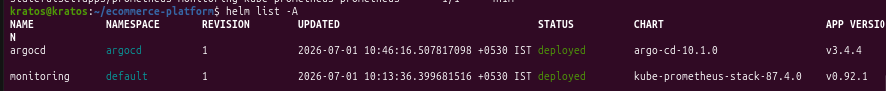

# 🚀 Kubernetes Platform Engineering Project

<p align="center">

Production-ready Platform Engineering project demonstrating containerization, Kubernetes orchestration, GitOps, CI/CD automation, observability, and production deployment practices.

Built and maintained by **Sahil Singh**.

</p>

---

## 📌 Project Overview

This repository showcases the evolution of my previous Docker-based E-Commerce project into a complete **Kubernetes Platform Engineering** implementation.

Instead of simply deploying containers, this project demonstrates how a modern Platform Engineer builds, deploys, monitors, automates, and manages workloads inside a Kubernetes cluster using industry-standard tools.

The application is deployed using Kubernetes manifests, monitored with the **Prometheus + Grafana** stack installed through **Helm**, automated through **GitHub Actions**, and continuously synchronized using **Argo CD (GitOps)**.

---

## 🎯 Project Highlights

- ✅ Dockerized Flask Application
- ✅ Kubernetes Deployments
- ✅ Stateful PostgreSQL Database
- ✅ ConfigMaps & Secrets
- ✅ Persistent Storage
- ✅ Services & Ingress
- ✅ Health Checks (Liveness & Readiness)
- ✅ Helm Package Manager
- ✅ Prometheus Monitoring
- ✅ Grafana Dashboards
- ✅ GitHub Actions CI Pipeline
- ✅ Docker Hub Image Registry
- ✅ GitOps with Argo CD
- ✅ Kustomize
- ✅ Rolling Updates
- ✅ Rollback Demonstration
- ✅ Production-style Repository Structure
- ✅ Real-world Troubleshooting & Debugging

---

# 🛠️ Technology Stack

| Category | Technologies |
|-----------|-------------|
| Language | Python (Flask) |
| Containerization | Docker |
| Orchestration | Kubernetes |
| Package Manager | Helm |
| GitOps | Argo CD |
| CI | GitHub Actions |
| Image Registry | Docker Hub |
| Monitoring | Prometheus |
| Visualization | Grafana |
| Database | PostgreSQL |
| Configuration | ConfigMaps & Secrets |
| Networking | ClusterIP Services, Ingress |
| Storage | Persistent Volumes |
| Version Control | Git & GitHub |

---

# 🏗️ Platform Architecture

```
                    Developer
                        │
                        ▼
                 GitHub Repository
                        │
                        ▼
               GitHub Actions CI
                        │
                        ▼
             Docker Image Build
                        │
                        ▼
                  Docker Hub
                        │
                        ▼
                 Argo CD (GitOps)
                        │
                        ▼
                 Kubernetes Cluster
        ┌───────────────┼────────────────┐
        │               │                │
        ▼               ▼                ▼
 Deployment        StatefulSet      ConfigMaps
        │               │                │
        ├───────────────┼────────────────┤
                        ▼
                  Kubernetes Services
                        │
                        ▼
                  Flask Backend API
                        │
                        ▼
                   PostgreSQL Database
                        │
                        ▼
          Prometheus ← Metrics → Grafana
```

---

## 📷 Architecture Diagram

> Replace with your latest architecture screenshot.

```



```

---

# ⭐ Skills Demonstrated

This project demonstrates practical experience with:

- Kubernetes Workloads
- Docker Image Management
- Kubernetes Networking
- ConfigMaps & Secrets
- Persistent Volumes
- Stateful Applications
- Health Probes
- Helm
- GitHub Actions
- Docker Hub
- GitOps
- Argo CD
- Kustomize
- Monitoring
- Prometheus
- Grafana
- Production Troubleshooting
- Rolling Updates
- Rollbacks
- Kubernetes Debugging

---

# 📂 Repository Structure

```text
kubernetes-platform-engineering/

├── .github/
│   └── workflows/
│       └── ci.yml
│
├── backend/
│   ├── app.py
│   ├── Dockerfile
│   ├── requirements.txt
│   └── README.md
│
├── compose/
│   └── docker-compose.yml
│
├── kubernetes/
│   ├── configmaps/
│   ├── deployments/
│   ├── ingress/
│   ├── secrets/
│   ├── services/
│   ├── statefulsets/
│   └── kustomization.yaml
│
├── monitoring/
│   └── prometheus/
│       └── prometheus.yml
│
├── screenshots/
│
├── kind-config.yaml
│
└── README.md
```

---

# 🚀 Platform Engineering Workflow

```
Developer
     │
     ▼
Git Commit
     │
     ▼
GitHub Repository
     │
     ▼
GitHub Actions
     │
     ▼
Docker Build
     │
     ▼
Docker Hub
     │
     ▼
Argo CD
     │
     ▼
Kubernetes Cluster
     │
     ▼
Application Running
     │
     ▼
Prometheus
     │
     ▼
Grafana Dashboards
```
---

# ☸️ Kubernetes Implementation

This project demonstrates the deployment of a production-style Flask application on Kubernetes while following industry-standard Platform Engineering practices.

The application was migrated from a Docker Compose environment into Kubernetes by gradually introducing native Kubernetes resources, networking, storage, monitoring, automation, and GitOps.

Instead of deploying a single Pod, the project uses multiple Kubernetes objects that work together to provide scalability, resiliency, automation, and observability.

---

# Kubernetes Resources

| Resource | Purpose |
|-----------|----------|
| Deployment | Manages Flask application replicas and rolling updates |
| ReplicaSet | Maintains desired number of Pods |
| Service | Internal communication inside the cluster |
| Ingress | External HTTP access to the application |
| ConfigMap | Stores non-sensitive configuration |
| Secret | Stores sensitive application credentials |
| StatefulSet | Deploys PostgreSQL with stable identity |
| PersistentVolumeClaim | Persistent database storage |
| Liveness Probe | Detects unhealthy containers |
| Readiness Probe | Prevents traffic until application is ready |

---

# 🚀 Backend Deployment

The Flask backend is deployed using a Kubernetes Deployment.

Key features include:

- Rolling Updates
- Replica management
- Health probes
- Kubernetes Service integration
- ConfigMap support
- Secret injection
- Automatic recovery

Deployment location:

```
kubernetes/deployments/backend-deployment.yaml
```

---

# 🗄 PostgreSQL StatefulSet

Unlike stateless applications, databases require stable identities and persistent storage.

For that reason PostgreSQL is deployed using a StatefulSet instead of a Deployment.

Benefits include:

- Stable Pod names
- Persistent storage
- Ordered startup
- Ordered shutdown
- Reliable database identity

Manifest location:

```
kubernetes/statefulsets/postgres-statefulset.yaml
```

---

# 💾 Persistent Storage

Persistent Volumes ensure that database data survives Pod restarts.

This project demonstrates:

- PersistentVolumeClaim
- StorageClass
- Dynamic provisioning
- Stateful application storage

Database data remains available even if the PostgreSQL container is recreated.

---

# 🔐 ConfigMaps & Secrets

The project separates configuration from application code.

## ConfigMap

Stores non-sensitive values including:

- Database host
- Database name
- Application configuration

Manifest:

```
kubernetes/configmaps/backend-configmap.yaml
```

---

## Secret

Stores sensitive information including:

- PostgreSQL Username
- PostgreSQL Password

Secrets are injected into the application as environment variables rather than hardcoding credentials inside the source code.

Manifest:

```
kubernetes/secrets/backend-secret.yaml
```

---

# 🌐 Kubernetes Networking

The application exposes multiple networking components.

### ClusterIP Service

Provides internal communication between Pods.

### Ingress

Provides HTTP routing into the cluster.

The application is accessible using:

```
http://ecommerce.local
```

Ingress Manifest

```
kubernetes/ingress/backend-ingress.yaml
```

---

# ❤️ Health Checks

Production applications should never receive traffic before becoming healthy.

This project implements:

## Readiness Probe

Purpose:

Determines when the application is ready to receive requests.

Endpoint

```
/health
```

---

## Liveness Probe

Purpose:

Automatically restarts unhealthy containers.

Endpoint

```
/health
```

These probes were also used during troubleshooting when intentionally deploying a faulty application version.

---

# 📦 Docker Hub Integration

The CI pipeline automatically builds Docker images and pushes them to Docker Hub.

Repository

```
sahilsinghchib/ecommerce-backend
```

Image versioning used throughout the project:

```
1.0.0

1.0.1

1.0.3

1.0.4
```

---

## Docker Hub Screenshot

```markdown

```

---

# ⚙️ GitHub Actions CI Pipeline

A complete CI workflow has been implemented using GitHub Actions.

Pipeline Steps

1. Checkout repository
2. Build Docker image
3. Authenticate with Docker Hub
4. Push image
5. Scan image using Trivy

Workflow file

```
.github/workflows/ci.yml
```

This demonstrates a production-style Continuous Integration workflow.

---

## GitHub Actions Pipeline

```markdown

```

---

# 🚀 GitOps using Argo CD

One of the key objectives of this project was to implement GitOps.

Instead of manually applying Kubernetes manifests, Argo CD continuously monitors the GitHub repository and automatically synchronizes changes into the Kubernetes cluster.

Workflow

```
Git Push

↓

Argo CD detects new commit

↓

Repository synchronized

↓

Kubernetes manifests applied

↓

Deployment updated automatically
```

Automatic synchronization was enabled with:

- Self Heal
- Auto Sync
- Pruning

This ensures the Kubernetes cluster always matches the desired state stored in Git.

---

## Argo CD Dashboard

```markdown

```

---

# 📦 Kustomize

The Kubernetes manifests are organized using **Kustomize**.

A central `kustomization.yaml` file references all Kubernetes resources, allowing Argo CD to deploy the application as a single logical unit.

Managed resources include:

- ConfigMaps
- Secrets
- Services
- Deployment
- StatefulSet
- Ingress

This provides a cleaner and more maintainable deployment structure than applying individual YAML files manually.

```
kubernetes/kustomization.yaml
```

---

# 🔄 Rolling Updates

The backend Deployment supports Kubernetes Rolling Updates.

Benefits:

- Zero downtime deployment
- Controlled rollout
- Automatic ReplicaSet creation
- Safe application upgrades

Each new image version automatically creates a new ReplicaSet while gradually replacing old Pods.

---

# ⏪ Rollback Demonstration

During development, a previous application image was intentionally deployed through GitOps.

The older version returned HTTP 500 on the `/health` endpoint, causing Kubernetes readiness and liveness probes to fail.

As a result:

- The new Pod never became Ready.
- The previous healthy Pod continued serving requests.
- Argo CD reported the deployment status.
- Reverting the image tag in Git automatically restored the stable version.

This demonstrated a complete real-world GitOps rollback workflow without manual intervention.

```
Git Change

↓

Argo CD Sync

↓

Deployment Failed

↓

Health Probes Failed

↓

Git Reverted

↓

Automatic Recovery
```

This mirrors how production environments safely recover from faulty releases.

---

# 📊 Observability & Monitoring

Deploying applications is only one part of Platform Engineering.

A production platform must also provide visibility into application health, infrastructure performance, resource utilization, and operational metrics.

This project integrates a complete monitoring stack using **Helm**, **Prometheus**, and **Grafana** to provide real-time observability of the Kubernetes environment.

---

# ⚓ Helm Package Manager

Managing large Kubernetes applications using raw YAML files quickly becomes difficult.

To simplify installation and lifecycle management, this project uses **Helm**, the package manager for Kubernetes.

Helm was used to deploy production-ready monitoring components instead of manually creating hundreds of Kubernetes manifests.

Benefits of Helm include:

- Simplified installation
- Version-controlled deployments
- Easy upgrades
- Easy rollbacks
- Reusable charts
- Centralized configuration

The monitoring stack was installed directly from the official Helm repository.

Example commands used:

```bash
helm repo add prometheus-community https://prometheus-community.github.io/helm-charts

helm repo update

helm install monitoring prometheus-community/kube-prometheus-stack
```

---

## Installed Helm Releases

| Release | Purpose |
|----------|---------|
| monitoring | Prometheus + Grafana + Alertmanager |
| argocd | GitOps Continuous Delivery Platform |

---

## Helm Release Screenshot

```markdown

```

---

# 📈 Prometheus Monitoring

Prometheus continuously collects metrics from the Kubernetes cluster.

The monitoring stack automatically discovers Kubernetes resources and scrapes metrics from:

- Kubernetes Nodes
- Pods
- Deployments
- StatefulSets
- Services
- Containers

Prometheus enables real-time visibility into platform performance.

Metrics collected include:

- CPU Usage
- Memory Usage
- Network Utilization
- Filesystem Usage
- Container Health
- Pod Status
- Node Status

---

## Prometheus Targets

The Prometheus Targets page verifies that all monitoring endpoints are healthy and actively being scraped.

```markdown

```

---

# 📉 Grafana Dashboards

Grafana provides visualization for metrics collected by Prometheus.

The dashboards allow real-time monitoring of infrastructure and application health.

Example dashboards include:

- Cluster CPU Usage
- Cluster Memory Usage
- Running Pods
- Kubernetes Nodes
- Filesystem Usage
- Network Traffic
- Container Performance

Grafana transforms raw metrics into interactive dashboards for operational visibility.

---

## Grafana Dashboard

```markdown

```

---

# 🚨 Alerting

The monitoring stack also deploys **Alertmanager** as part of the Helm installation.

Alertmanager is responsible for processing alerts generated by Prometheus.

Although advanced notification integrations (Email, Slack, Microsoft Teams, PagerDuty) were not configured in this project, the platform is fully prepared to support them.

Typical production alerts include:

- Pod CrashLoopBackOff
- High CPU Utilization
- High Memory Usage
- Node Down
- Disk Space Running Low
- Application Unavailable

---

# 🔍 Production Troubleshooting

Throughout the project, several real-world issues were intentionally or naturally encountered and resolved.

These scenarios helped build practical Kubernetes troubleshooting skills.

| Issue | Resolution |
|--------|------------|
| ErrImagePull | Corrected Docker image tag and pushed image to Docker Hub |
| ImagePullBackOff | Updated Deployment to use an existing image version |
| CrashLoopBackOff | Investigated application logs and resolved failing health endpoint |
| Readiness Probe Failures | Corrected application behavior to return HTTP 200 |
| Liveness Probe Restarts | Verified application stability and health checks |
| GitHub Actions Authentication | Configured Docker Hub credentials using GitHub Secrets |
| Argo CD Sync Failure | Corrected Kustomize configuration and synchronized GitOps workflow |
| Rolling Update Failure | Reverted image version and validated automatic recovery |

These incidents closely resemble operational issues encountered in production Kubernetes environments.

---

# 📸 Project Gallery

The repository includes screenshots captured during implementation to demonstrate the platform in action.

| Screenshot | Description |
|------------|-------------|
| Architecture Diagram | Overall platform design |
| Application Running | Flask application deployed successfully |
| GitHub Actions | Successful CI pipeline execution |
| Docker Hub | Container image repository |
| Argo CD | GitOps synchronization dashboard |
| Helm Releases | Installed Helm charts |
| Prometheus Targets | Monitoring endpoints |
| Grafana Dashboard | Metrics visualization |
| Kubernetes Pods | Running workloads |
| Kubernetes Resources | Cluster resources |

---

# 🔐 Security Considerations

The project follows several Kubernetes security best practices.

Implemented:

- Kubernetes Secrets for credentials
- Environment variable injection
- Separation of configuration using ConfigMaps
- Version-controlled infrastructure
- GitOps deployment workflow
- Container image versioning

Future enhancements may include:

- RBAC
- Network Policies
- External Secrets Operator
- HashiCorp Vault
- Image Signing
- Admission Controllers
- Policy Enforcement using Kyverno or OPA Gatekeeper

---

# 📦 Production Practices Demonstrated

This repository demonstrates several Platform Engineering practices commonly used in production environments.

- Infrastructure as Code
- GitOps
- Immutable Container Images
- Declarative Kubernetes Manifests
- Configuration Management
- Stateful Workloads
- Health Monitoring
- Automated Deployments
- CI/CD Automation
- Infrastructure Observability
- Rolling Updates
- Safe Rollbacks
- Centralized Monitoring
- Operational Troubleshooting

---

# 🚀 Getting Started

Follow these steps to deploy the complete platform locally.

---

# Prerequisites

Install the following tools before starting.

| Tool | Purpose |
|------|---------|
| Git | Source Code Management |
| Docker | Container Runtime |
| kubectl | Kubernetes CLI |
| Kind | Local Kubernetes Cluster |
| Helm | Kubernetes Package Manager |
| Argo CD | GitOps Continuous Delivery |

---

# Clone Repository

```bash
git clone https://github.com/sahil-infrastructure/kubernetes-platform-engineering.git

cd kubernetes-platform-engineering
```

---

# Create Kubernetes Cluster

This project uses **Kind (Kubernetes in Docker)** for local development.

```bash
kind create cluster \
--name ecommerce-platform \
--config kind-config.yaml
```

Verify cluster

```bash
kubectl get nodes
```

Expected output

```text
NAME                                   STATUS
ecommerce-platform-control-plane        Ready
```

---

# Build Docker Image

```bash
docker build \
-t sahilsinghchib/ecommerce-backend:1.0.4 \
./backend
```

Push image

```bash
docker push sahilsinghchib/ecommerce-backend:1.0.4
```

---

# Deploy Kubernetes Resources

Since the project uses **Kustomize**, a single command deploys all resources.

```bash
kubectl apply -k kubernetes/
```

Verify deployment

```bash
kubectl get all
```

---

# Deploy Monitoring Stack

Add Helm Repository

```bash
helm repo add prometheus-community https://prometheus-community.github.io/helm-charts
```

Update repository

```bash
helm repo update
```

Install monitoring

```bash
helm install monitoring prometheus-community/kube-prometheus-stack
```

Verify Helm releases

```bash
helm list -A
```

---

# Install Argo CD

Create namespace

```bash
kubectl create namespace argocd
```

Install Argo CD

```bash
kubectl apply \
-n argocd \
-f https://raw.githubusercontent.com/argoproj/argo-cd/stable/manifests/install.yaml
```

Verify

```bash
kubectl get pods -n argocd
```

---

# Access the Application

After deployment the application becomes available through Ingress.

```
http://ecommerce.local
```

Health endpoint

```
http://ecommerce.local/health
```

Expected response

```json
{
  "status":"healthy"
}
```

---

# Repository Walkthrough

The repository has been organized into logical components.

## backend/

Contains the Flask application.

Includes

- Application Source Code
- Dockerfile
- Requirements
- Backend Documentation

---

## compose/

Contains the original Docker Compose implementation from the previous project.

This demonstrates the migration journey from Docker Compose to Kubernetes.

---

## kubernetes/

Contains all Kubernetes manifests.

Subdirectories

```
configmaps/

deployments/

ingress/

secrets/

services/

statefulsets/
```

---

## monitoring/

Contains monitoring configuration files.

Currently includes

```
Prometheus configuration
```

Monitoring stack itself is deployed through Helm.

---

## screenshots/

Contains screenshots captured throughout implementation.

Examples

- Architecture
- GitHub Actions
- Argo CD
- Docker Hub
- Grafana
- Prometheus
- Helm
- Kubernetes

---

# Validation Checklist

After deployment verify the following.

## Cluster

```bash
kubectl get nodes
```

Expected

```
Ready
```

---

## Pods

```bash
kubectl get pods
```

Expected

```
Running
```

---

## Services

```bash
kubectl get svc
```

Expected

```
ClusterIP
```

---

## Ingress

```bash
kubectl get ingress
```

Expected

```
ADDRESS assigned
```

---

## StatefulSet

```bash
kubectl get statefulset
```

Expected

```
READY 1/1
```

---

## Persistent Volume

```bash
kubectl get pvc
```

Expected

```
Bound
```

---

## GitHub Actions

Every push to the **main** branch should trigger the CI workflow automatically.

Expected

```
Workflow Success
```

---

## Docker Hub

Latest image should appear automatically after a successful pipeline execution.

---

## Argo CD

Application should display

```
Health

Healthy

Sync

Synced
```

---

## Prometheus

Targets page

```
UP
```

for all monitored components.

---

## Grafana

Dashboards should display

- CPU Usage
- Memory Usage
- Running Pods
- Node Metrics
- Container Metrics

without errors.

---

# Project Outcomes

After completing this project, the platform is capable of:

- Building Docker images
- Storing images in Docker Hub
- Deploying applications to Kubernetes
- Managing Stateful workloads
- Persisting PostgreSQL data
- Managing configuration through ConfigMaps
- Protecting credentials using Secrets
- Exposing services using Ingress
- Monitoring infrastructure with Prometheus
- Visualizing metrics using Grafana
- Installing applications using Helm
- Automating deployments using GitHub Actions
- Synchronizing infrastructure using Argo CD
- Demonstrating GitOps workflows
- Performing Rolling Updates
- Recovering through Rollbacks
---

# 💡 Key Learnings

Building this project provided hands-on experience with the complete lifecycle of deploying and managing applications on Kubernetes.

Throughout development, I gained practical knowledge in:

## Kubernetes

- Designing Kubernetes workloads
- Deployments vs StatefulSets
- ReplicaSets
- Kubernetes Services
- Ingress Controllers
- Labels & Selectors
- Health Probes
- Namespaces
- Storage Management
- ConfigMaps
- Secrets

---

## Platform Engineering

- Infrastructure as Code
- Declarative Infrastructure
- GitOps Workflows
- Continuous Integration
- Continuous Delivery
- Kubernetes Operations
- Production Troubleshooting
- Observability
- Deployment Automation

---

## DevOps Tooling

- Docker
- Docker Hub
- GitHub
- GitHub Actions
- Helm
- Argo CD
- Prometheus
- Grafana

---

## Production Concepts

- Zero Downtime Deployments
- Rolling Updates
- Rollbacks
- Container Health Checks
- Persistent Storage
- Configuration Management
- Infrastructure Monitoring
- Kubernetes Debugging

---

# 🐞 Real-world Challenges Faced

This project intentionally includes challenges encountered during development and the approaches used to resolve them.

| Challenge | Resolution |
|------------|------------|
| ErrImagePull | Verified image tags and pushed images to Docker Hub |
| ImagePullBackOff | Updated Kubernetes Deployment with the correct image version |
| CrashLoopBackOff | Investigated Pod logs and corrected application behavior |
| Readiness Probe Failures | Fixed the `/health` endpoint to return HTTP 200 |
| Liveness Probe Failures | Improved application stability and validated health checks |
| Argo CD Synchronization Issues | Corrected Kustomize configuration and repository structure |
| GitHub Actions Authentication | Configured Docker Hub credentials using GitHub Secrets |
| Helm Installation | Installed and managed the monitoring stack using official Helm charts |
| Stateful Database Deployment | Migrated PostgreSQL from Deployment to StatefulSet with persistent storage |
| GitOps Rollback | Reverted a faulty image version through Git, allowing Argo CD to automatically restore the stable deployment |

These scenarios closely resemble operational issues encountered in production Kubernetes environments and significantly strengthened my troubleshooting skills.

---

# 📈 Future Enhancements

The project has been designed with future improvements in mind.

Planned enhancements include:

- Terraform for Infrastructure Provisioning
- Azure Kubernetes Service (AKS)
- External Secrets Operator
- HashiCorp Vault
- Horizontal Pod Autoscaler (HPA)
- Vertical Pod Autoscaler (VPA)
- Network Policies
- RBAC
- Service Mesh (Istio)
- OpenTelemetry
- Loki for Centralized Logging
- Kyverno / OPA Gatekeeper
- Blue-Green Deployments
- Canary Deployments
- Multi-Cluster GitOps

---

# 🎯 Skills Demonstrated

This repository demonstrates practical experience with:

- Docker
- Docker Compose
- Docker Hub
- Kubernetes
- Helm
- GitHub Actions
- GitOps
- Argo CD
- Kustomize
- Prometheus
- Grafana
- Flask
- PostgreSQL
- Stateful Applications
- ConfigMaps
- Secrets
- Persistent Volumes
- Ingress
- CI/CD
- Infrastructure Automation
- Monitoring
- Observability
- Troubleshooting

---

# 📸 Complete Project Gallery

The repository contains screenshots captured throughout the implementation process.

| Screenshot | Description |
|------------|-------------|
| Architecture Diagram | Overall Platform Design |
| Application Running | Flask Application deployed on Kubernetes |
| Docker Hub | Container Image Repository |
| GitHub Actions | Successful CI Pipeline |
| Argo CD Dashboard | GitOps Synchronization |
| Helm Releases | Installed Monitoring Stack |
| Prometheus Targets | Monitoring Endpoints |
| Grafana Dashboard | Infrastructure Metrics |
| Kubernetes Pods | Running Workloads |
| Kubernetes Resources | Cluster Resources |

---

# 🏆 Project Summary

This project represents the complete transformation of a Docker Compose application into a production-style Kubernetes platform.

The implementation demonstrates:

- Containerization using Docker
- Kubernetes-native application deployment
- Stateful database management
- Persistent storage
- Configuration management
- Secure secret handling
- Automated CI pipelines
- GitOps deployment using Argo CD
- Continuous synchronization
- Infrastructure monitoring
- Rolling updates
- Automated rollback
- Production troubleshooting

More importantly, the project emphasizes **understanding how modern cloud-native platforms are designed, automated, monitored, and maintained**, rather than simply deploying containers.

---

# 👨‍💻 About the Author

## Sahil Singh

**Platform Engineer**

This repository was built as part of my hands-on Platform Engineering learning journey with a strong focus on designing, deploying, automating, monitoring, and operating cloud-native applications using modern DevOps and Kubernetes practices.

I enjoy solving infrastructure challenges, automating deployments, and continuously expanding my knowledge of cloud-native technologies.

---

## Connect with Me

**GitHub**

https://github.com/sahil-infrastructure

**LinkedIn**

> https://www.linkedin.com/in/sahil-s-1270581a2/

---

# ⭐ Support

If you found this project helpful or informative:

⭐ Star the repository

🍴 Fork the repository

💬 Share your feedback

Contributions and suggestions are always welcome.

---

# 📄 License

This repository is provided for educational and portfolio purposes.

Feel free to explore the implementation and adapt the ideas for your own learning.

---

<p align="center">

### ⭐ Thank you for visiting this repository! ⭐

If you enjoyed exploring this project, consider giving it a star.

Happy Learning! 🚀

</p>

